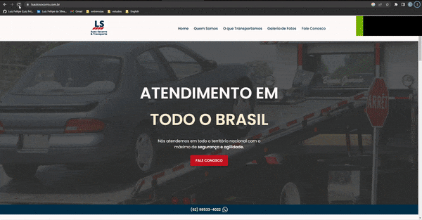

# LS Auto Socorro :articulated_lorry:

 
 

 <a href="#project">👉 Project</a>
 <a href="#technologies">👉 Technologies</a>
 <a href="#execution">👉 Execution</a>
 <a href="#author">👉 Author</a>

 
<h2 id="project">Project</h2>
 

This is a freelance project done for a transport company.

The Prototype of this project can be found in this [link from figma](https://www.figma.com/file/68XacTuHLywH7fnWDy2juP/LS-AUTO-SOCORRO?node-id=0%3A1&t=pQKgxgTdMuP4byUs-1).

 

<h3><a target="_blank" href="https://www.lsautosocorro.com.br/">Click here to see the project</a></h3>

 

<h3 id="components">Metodology</h3>

 

In this project i followed the [Mobile First](https://medium.com/@Vincentxia77/what-is-mobile-first-design-why-its-important-how-to-make-it-7d3cf2e29d00)

 

<h2 id="technologies">Used Technologies</h2>

 

This project was developed with the following technologies:

 

- <a target="_blank" href="https://nodejs.org/en/">Node 16.17</a>
- <a target="_blank" href="https://reactjs.org/">React 17.0</a>
- <a target="_blank" href="https://nextjs.org/">Next JS 12.0.7</a>
- <a target="_blank" href="https://www.typescriptlang.org/">TypeScript 4.5.4</a>
- <a target="_blank" href="https://www.framer.com/motion/">Framer Motion</a>
- <a target="_blank" href="https://fontawesome.com/">Font Awesome</a>
- <a target="_blank" href="https://stitches.dev/">Stitches</a>
- <a target="_blank" href="https://eslint.org/">ESLint</a>

 

<h2 id="execution">👨🏻‍💻 Execution</h2>
 

To run the project:
 

- First we have to:
  - Clone the project by running this command in the terminal `git clone <repo_url>`;
       
 
- Open the project folder in the terminal and run:
  - `yarn` or `npm install` -> To install all dependencies;
  - `yarn dev` or `npm run dev` -> To run the project;

  

<h2 id="author">👨🏻‍💻 Author</h2>

 

<h4>Luiz Fellipe<h4> 

 

